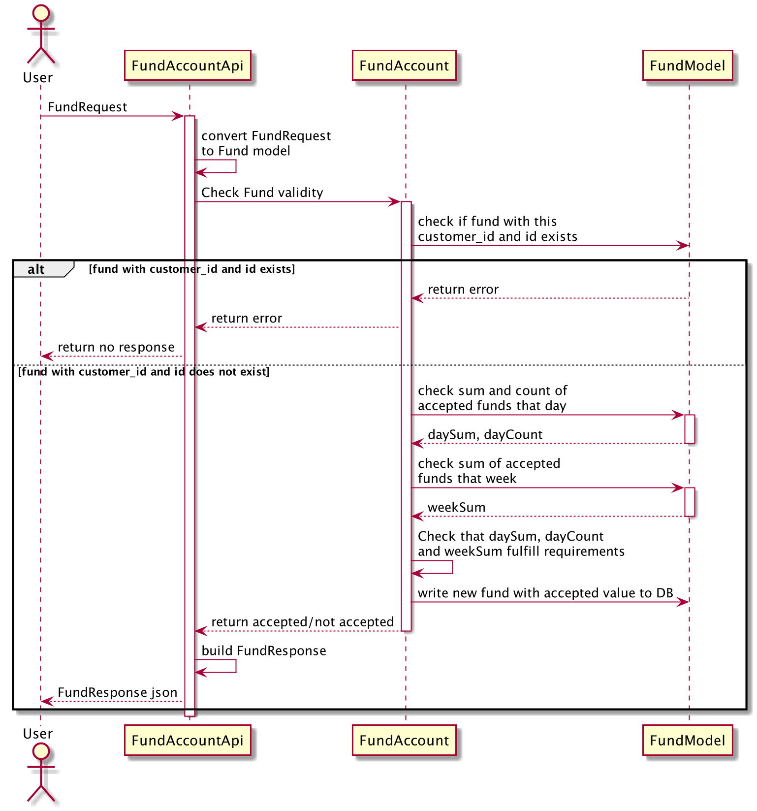

Velocity limiter
================

This is an implementation of velocity limits based on the requirements:

- A maximum of $5,000 can be loaded per day
- A maximum of $20,000 can be loaded per week
- A maximum of 3 loads can be performed per day, regardless of amount

A day starts at midnight.

A week starts on Monday midnight and last 7 days.

# Running server
To run the server, first you should setup `GOPATH` environment variable to the project root.
Then install some packages and then 
```
go get -u gorm.io/gorm
go get -u gorm.io/driver/sqlite
go get -u github.com/gorilla/mux
go run main.go
```

The server is running by default on port 8080, it can be changed on `main.go` file.

# Usage: REST API

POST to `/api/fund`:
```json
{
  "id": "1234",
  "customer_id": "1234",
  "load_amount": "$123.45",
  "time": "2018-01-01T00:00:00Z"
}
```
Response should look like:
```json
{ "id": "1234", "customer_id": "1234", "accepted": true }
```
* If the request is invalid an error is thrown
* If the fund does not obey the limits then accepted will be false
* If the fund in the request has customer_id and id which were previously given, there will be no response   


# Code flow
See sequence diagram in `docs` folder.


# Decisions made
* in memory sqlite db
* Tests code include basic tests for logic, the massive test can be run using the given input file:
```
./test_input.sh docs/input.txt > docs/output.actual
diff docs/output.actual docs/output.txt
```
Notice there is one difference when the same customer_id and id are given in the input, 
the actual output is printed as an empty line (due to the bash script, not because of an error)
`docs/output.actual` is included in the repository but can be generated when running the above code.

### DB model

I chose to go with relational database for simplicity. 
Since we can assume the input in ascending and not parallel - it makes sense.

Because of the nature of the input we can implement a background method to remove
entries from the DB once they are a week old.


# Next steps (missing)
* dockerize
* get `go mod` to work
* write integration tests
* enrich and compile godoc